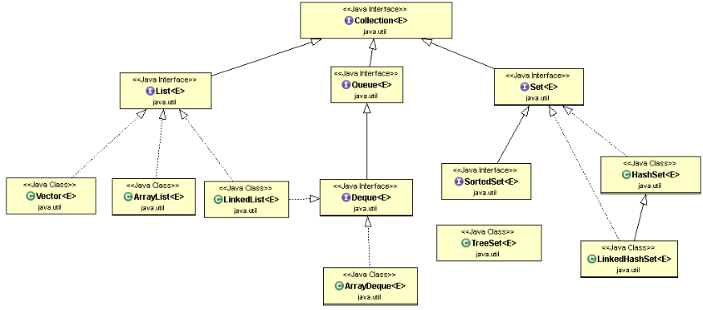
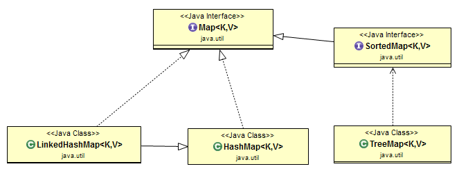

# Collection In Detail

**Collection:** Is an interface in util package

**Collections:** is a utility class. sort/min/max

### Collection Hierarchy:

*TreeSet implement sortedSet

### Iterable Interface:

This is extended by collection interface
Main purpose is to provide an iterator for the collection
Only one abstract method iterator().

### Map Hierarchy:

### **ArrayList:**

- Is a dynamic array as we dont need to specify the size while defining it
- continuous memory allocation
- allows random access
- duplicates are allowed
- nulls are allowed
- insertion order is preserved
- default size is 10
- contains() - internally uses indexOf method which iterates entire arrayList

Few Drawbacks:
- slower than array
- not thread safe
- performance may degrade while inserting or deleting element in/from the middle of the list
- whenever we remove an element, the arrayList is traversed and memory bits are shifted

### **LinkedList:**

- Not continuous memory location
- insertion and deletion are faster
- data access is slow
- no drawback of shifting memory units
- allows multiple null values

### **Vector:**

- Similar to linked list
- but also thread safe
- poor performance than arraylist
- can contains nulls and duplicate

### **CopyOnWriteArrayList:**

- thread-safe version of arraylist
- is to be used in a Thread based environment where read operations are very frequent and update operations are rare.
- Iterator of CopyOnWriteArrayList will never throw ConcurrentModificationException.
- Any type of modification to CopyOnWriteArrayList will not reflect during iteration since the iterator was created

### **HashSet:**

- contains unique elements
- can contains one null values
- Doesn't maintain insertion order
- hashing
- for a custom class to be inserted in hash set, add hashCode and equals
- internally it create a hash map. Key - values to be inserted in set, and value - all are constant and same
- default size is 16
- load factor is 0.75, once it reaches same it increase the size automatically
- implements Set/Serializable/Cloneable
- it uses contains() method to check the presence of element
- the contains() of HashSet runs in O(1) time. Getting the object's bucket location is a constant time operation. Taking into account possible collisions, the lookup time may rise to log(n) because the internal bucket structure is a TreeMap.

### **LinkedHashSet:**

- ordered version of hashset
- maintains insertion order
- allows only one null value
 

### **TreeSet:**

- sorted hash set
- null is not allowed
- sorted and ascending order
- Doesn't preserve insertion order
- 

### **HashMap:**

- key value pair
- hashing
- Duplicate key will be overwritten
- one null key allowed
- Not synchronized
- No insertion order
- retrieval and insertion is very fast , usually o(1)
- initial capacity is 16 and load factor is 0.75
- hashCode is used to find out the bucket location in the array
- Rehashing - happens when we reach the load factor. It doubles the size in power of two
- Hash collision - When multiple different keys return same hash code then hash collision arises. In this case a linked list is maintained to store multiple key on same bucket location.
- From Java 8 onwards, when bucket size reaches certain threshhold (usually 8) it transformed in to self balancing BST, which brings the time from O(n) to O(logn). For this to work, keys of the hashMap needs to implement comparable interface.

### Internal Structure of HashMap:

    int hash
    K key
    V value
    Node next

* Initial capacity is in power of 2. Default is 16
* After 12 elements rehashing takes place.

### **HashTable:**

- Synchronized
- Locking the entire map object for read/update/write
- get() method of hash table is synchronized, so multiple threads can't read

### **LinkedHashMap:**

- insertion order is preserved for keys
- can contains null
- retrieval and insertion is very fast , usually o(1)

### **TreeMap:**

- sorted
- O(log n) for insertion and retrieval
- Null keys are not allowed -> give NullPointerException

### **SynchronizedMap:**

    // Here it is backed by HashMap
    HashMap<String, Integer> map = new HashMap<>();
    Map<String, Integer> syncMap = Collections.synchronizedMap(map);
    

- when using Collections.synchronizedMap(), null support depends on the input Map. 
- With HashMap or LinkedHashMap - can have one null as a key 
- With TreeMap, we cant have null keys
- read/Write operation acquire lock on entire map
- Concurrency level cant be set
- at a given time only one thread is able to read/write as it acquires lock on entire object
- ###### **Should use - when data consistency is utmost priority**

### **ConcurrentHashMap:**

- Threadsafe
- Null is not allowed
- It locks only the portion of map being modified, rather than entire map
- Underlying DS is hashtable
- Concurrency level can be set
- Multiple threads can read at a time without locking
- For update/write, the thread must lock the particular segment.  This is known as segment locking or bucket locking. Segment will be locked only for other write in the same segment
- there is no locking at the object level
- It doesn't throw concurrentModificationException is one thread tries to modify it and other is iterating it. Fail safe iterator
- put(), clear(), putAll(), remove() are not fully synchronized, concurrent retrieval while writing could give old values
- if you have few write operation - keeping the concurrency level low will be better
- ###### **Should use - when concurrent and performance is priority**

In the ConcurrentHashMap Api , you will find the following constants.

    static final int DEFAULT_INITIAL_CAPACITY = 16;
    static final int DEFAULT_CONCURRENCY_LEVEL = 16;

- Each lock is used to lock the single bucket, which means 16 threads can operate at a given time

- Read - allows full concurrency for reads, meaning that any given number of threads can read the same key simultaneously. 
That also means that reads don't block and are not blocked by write operations. Thus, reading from the map could get “old” or inconsistent values.

- Write - partial concurrency for writes, which blocks other writes at the same map key and allows writes to different keys.

- **ConcurrentHashMap is best suited when you have multiple readers and a few writers.** 

- If writers outnumber the reader, or the writer is equal to the reader, then the performance of 
ConcurrentHashMap effectively reduces to synchronized map or Hashtable. 

- Performance of CHM drops, because you got to lock all portions of Map, 
and effectively each reader will wait for another writer, operating on that portion of Map. 

- ###### **ConcurrentHashMap is a good choice for caches, which can be initialized during application startup and later accessed by many request processing threads.**

        public ConcurrentHashMap(int initialCapacity,float loadFactor,int concurrencyLevel)

