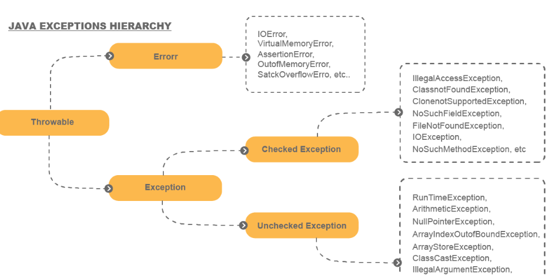
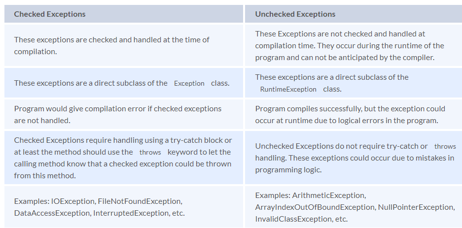

# **Exception Handling**

An Exception refers to abnormal behaviour of an application that occurs at the time of execution that could lead to the termination of that application if not handled.

### Exception Hierarchy:

### Exception propagation:

* Process of Handle or caught
* If not caught then it will goes down to the method call stack.

### Throw:

    if (task.getStatus().equals("outdated")) {
        throw new OutdatedTaskException("Task is outdated");
    }

### Throws: used with method signature

    public void someMethod() throws NullPointerException, FileNotFoundException {
    // do something
    }

## Checked Exception/ Compile Time Exception:

## Unchecked Exception/ Runtime Exception:

### Difference Between checked and unchecked exception:

### Handle Multiple Exception:

    try {
    // ...
    } catch (FileNotFoundException | EOFException exception) {
    // ...
    }

### Can we have statements between try, catch and finally blocks?

No. This is because they form a single unit.

### finally keyword: 

This is used in conjunction with the try-catch block or the try block where we want to run some logic whether or not an exception has occurred

### What is the difference between ClassNotFoundException and NoClassDefFoundError?

Both these exceptions occur when ClassLoader or JVM is not able to find classes while loading during run-time. 

#### ClassNotFoundException: 
when we try to load a class that is not found in the classpath at runtime by making use of the loadClass() or Class.forName() methods.

#### NoClassDefFoundError: 
class was present at compile-time but was not found at runtime.

### Does the finally block always get executed in the Java program?

* When exception occurred in try-catch block or not it will run
* In case of System.exit(0) in either try or catch it will skip

### Why it is always recommended to keep the clean-up activities like closing the I/O resources or DB connections inside a finally block?

* By keeping these cleanup operations in the finally block, it is always ensured that the operations are executed and the resources are closed accordingly. 
* However, to avoid exceptions in the finally block, we need to add a proper validation check for the existence of the resource and then attempt to 
clean up the resources accordingly

### try with resource:

* allows us to declare resources to be used in a try block with the assurance that the resources will be closed after the execution of that block.
* We dont need extra finally block when using try-with-resources 

    try (Scanner scanner = new Scanner(new File("test.txt"))) {
    while (scanner.hasNext()) {
    System.out.println(scanner.nextLine());
    }
    } catch (FileNotFoundException fnfe) {
    fnfe.printStackTrace();
    }

### A Custom Resource With AutoCloseable:

To construct a custom resource that will be correctly handled by a try-with-resources block, 
the class should implement the Closeable or AutoCloseable interfaces and override the close method

    public class MyResource implements AutoCloseable {
        @Override
        public void close() throws Exception {
            System.out.println("Closed MyResource");
        }
    }