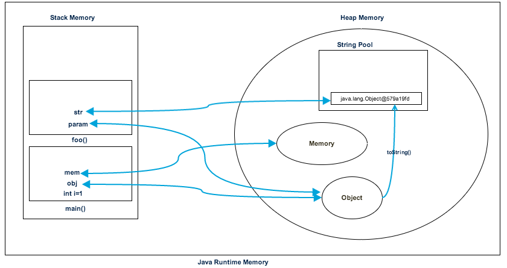

**Memory Management**

### **Stack:**

   1) methods, local variables, and reference variables of the objects.
   2) it follows LIFO
   3) faster
   4) smaller in size
   5) StackOverflowError
   6) We can increase using -Xss
   7) Separate stack is created for each object. So thread safe
   8) Memory allocation is contiguous

## **Heap:**

   1) stores object and JRE classes
   2) doesn't follow any order
   3) slower
   4) larger in size
   5) OutOfMemoryError
   6) increase using -Xmx and -Xms
   7) it is shared among all threads. Non thread safe
   8) Memory allocation is random

Example:

    public class Memory {

    public static void main(String[] args) { // Line 1
        int i=1; // Line 2 -- i=1 local variable and created in stack
        Object obj = new Object(); // Line 3 -- obj in stack and New Object in heap
        Memory mem = new Memory(); // Line 4 - mee in satck and new Memory n heap
        mem.foo(obj); // Line 5 -- 
    } // Line 9

    private void foo(Object param) { // Line 6 - foo methods memory allocation in satcka and param create din stack
        String str = param.toString(); //// Line 7 - str in stack and para.toString create in heap 
        System.out.println(str);
    } // Line 8
    }
    

**Let’s go through the steps of the execution of the program.**

  * As soon as we run the program, it loads all the Runtime classes into the Heap space. When the main() method is found at line 1, Java Runtime creates stack memory to be used by main() method thread.
  * We are creating primitive local variable at line 2, so it’s created and stored in the stack memory of main() method.
  * Since we are creating an Object in the 3rd line, it’s created in heap memory and stack memory contains the reference for it. A similar process occurs when we create Memory object in the 4th line.
  * Now when we call the foo() method in the 5th line, a block in the top of the stack is created to be used by the foo() method. Since Java is pass-by-value, a new reference to Object is created in the foo() stack block in the 6th line.
  * A string is created in the 7th line, it goes in the String Pool in the heap space and a reference is created in the foo() stack space for it.
  * foo() method is terminated in the 8th line, at this time memory block allocated for foo() in stack becomes free.
  * In line 9, main() method terminates and the stack memory created for main() method is destroyed. Also, the program ends at this line, hence Java Runtime frees all the memory and ends the execution of the program.

**Heap Memory Model:**

1) Young generation

    - this is where all new objects are allocated and aged. 
    - A minor Garbage collection occurs when this fills up.
2) Old Generation
    - this is where long surviving objects are stored. 
    - When objects are stored in the Young Generation, a threshold for the object's age is set, 
         and when that threshold is reached, the object is moved to the old generation.
3) Permanent Generation
    - this consists of JVM metadata for the runtime classes and application methods.